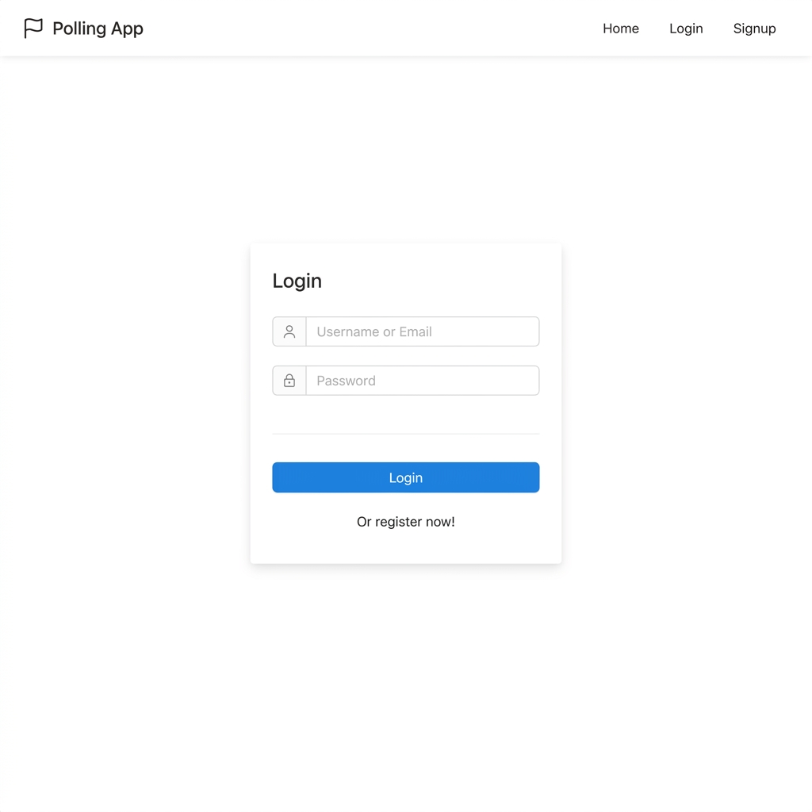
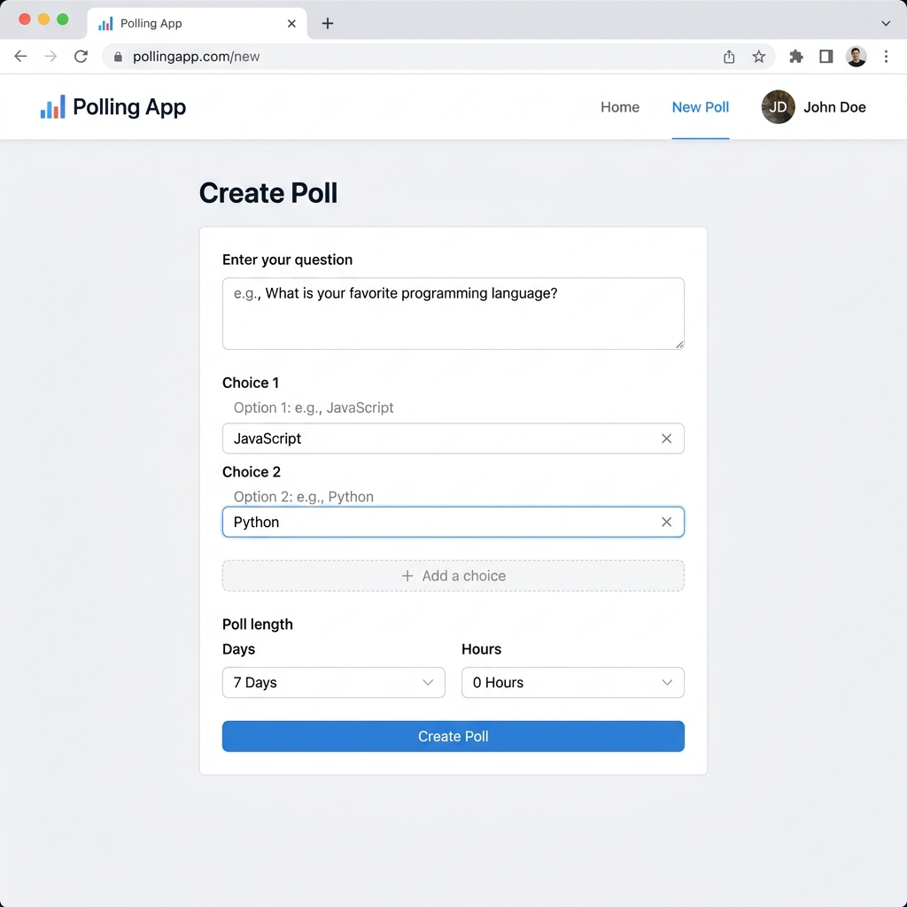
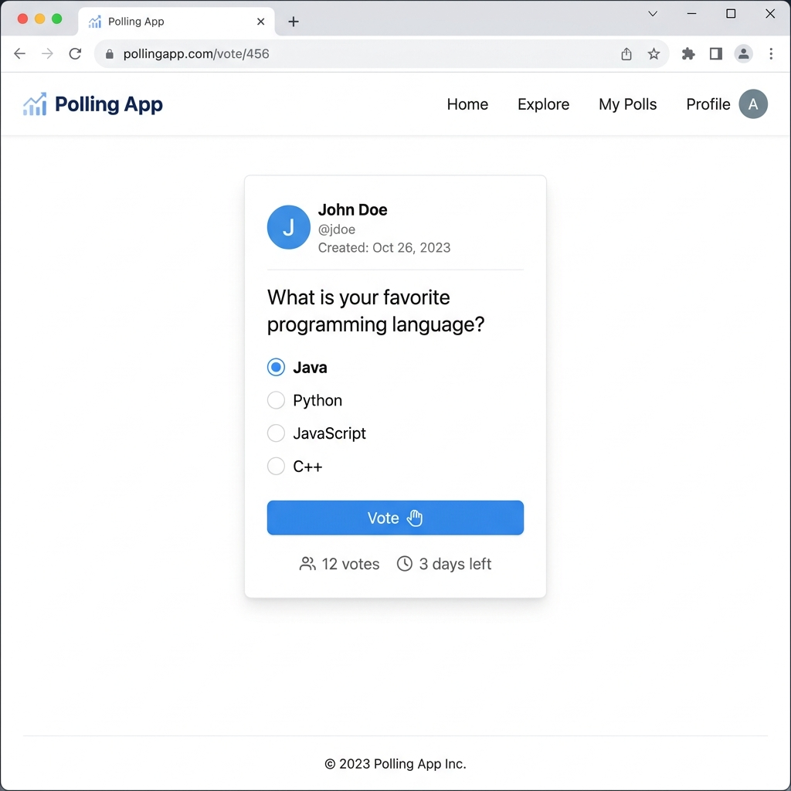
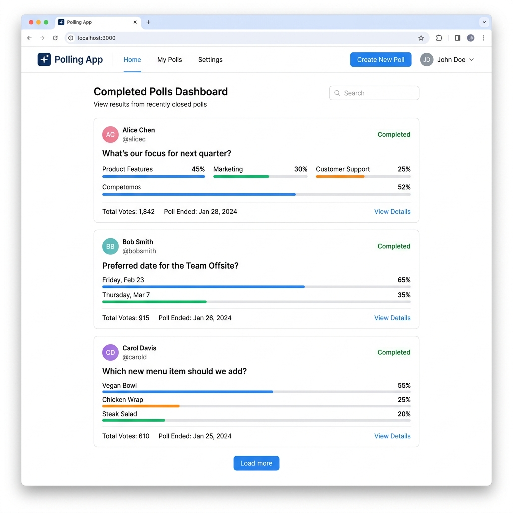

# 📊 Polling App — Full Stack Polls Application

A full-stack polling application similar to Twitter polls, built with **React**, **Spring Boot**, **Spring Security**, **JWT Authentication**, and **PostgreSQL**.

---

## 🌐 Live Demo

> **[https://polling-app-z854.onrender.com](https://polling-app-z854.onrender.com)**
>
> ⚠️ _The app is hosted on Render's free tier. The first request may take ~30 seconds if the server has spun down due to inactivity._

---

## 📸 Screenshots

<table>
  <tr>
    <td align="center"><b>🔐 Login Page</b></td>
    <td align="center"><b>📝 Create Poll</b></td>
  </tr>
  <tr>
    <td></td>
    <td></td>
  </tr>
  <tr>
    <td align="center"><b>🗳️ Voting Page</b></td>
    <td align="center"><b>📊 Dashboard</b></td>
  </tr>
  <tr>
    <td></td>
    <td></td>
  </tr>
</table>

---

## 🏗️ Architecture

```
┌─────────────────────────────────────────────────────┐
│                    Client (Browser)                  │
│                  React + Ant Design                  │
└──────────────────────┬──────────────────────────────┘
                       │ REST API (JSON)
                       ▼
┌─────────────────────────────────────────────────────┐
│              Spring Boot Backend (API)               │
│  ┌──────────────┐  ┌────────────┐  ┌──────────────┐ │
│  │ Spring MVC   │  │  Spring    │  │     JWT      │ │
│  │ Controllers  │  │  Security  │  │  Auth Filter │ │
│  └──────┬───────┘  └─────┬──────┘  └──────┬───────┘ │
│         │                │                │         │
│  ┌──────▼────────────────▼────────────────▼───────┐ │
│  │           Spring Data JPA (Repositories)       │ │
│  └────────────────────┬───────────────────────────┘ │
└───────────────────────┼─────────────────────────────┘
                        │ JDBC
                        ▼
              ┌──────────────────┐
              │    PostgreSQL    │
              │    Database      │
              └──────────────────┘
```

### Tech Stack

| Layer            | Technology                                  |
| ---------------- | ------------------------------------------- |
| **Frontend**     | React 16 · Ant Design 3 · React Router 4   |
| **Backend**      | Spring Boot 2.7 · Spring MVC · Spring Data JPA |
| **Security**     | Spring Security · JWT (JSON Web Tokens)     |
| **Database**     | PostgreSQL                                  |
| **Build Tools**  | Maven (Backend) · npm (Frontend)            |
| **Deployment**   | Render · Docker (Multi-stage build)         |

---

## ✨ Features

- **User Authentication** — Signup & Login with JWT-based authentication
- **Create Polls** — Create polls with up to 6 choices and configurable expiration
- **Vote** — Cast your vote on active polls (one vote per user per poll)
- **Real-time Results** — View live vote percentages with visual progress bars
- **User Profiles** — View user profiles with their created polls and voting history
- **Pagination** — Infinite scroll with "Load More" for poll lists
- **Role-based Authorization** — USER and ADMIN roles powered by Spring Security
- **Responsive Design** — Works on desktop and mobile browsers

---

## 📁 Project Structure

```
Polling-App/
├── polling-app-client/          # React Frontend
│   ├── public/                  # Static assets
│   └── src/
│       ├── app/                 # App component & routing
│       ├── common/              # Shared components (Header, Footer, etc.)
│       ├── constants/           # App constants & API config
│       ├── poll/                # Poll components (PollList, NewPoll, Poll)
│       ├── user/                # User components (Login, Signup, Profile)
│       └── util/                # API utilities & helpers
│
├── polling-app-server/          # Spring Boot Backend
│   └── src/main/java/com/example/polls/
│       ├── config/              # Security & Web MVC configuration
│       ├── controller/          # REST API controllers
│       ├── exception/           # Custom exception handlers
│       ├── model/               # JPA Entity models
│       ├── payload/             # Request/Response DTOs
│       ├── repository/          # Spring Data JPA repositories
│       ├── security/            # JWT & auth components
│       ├── service/             # Business logic services
│       └── util/                # Utility classes
│
├── Dockerfile                   # Multi-stage Docker build
├── render.yaml                  # Render deployment blueprint
└── README.md
```

---

## 🔌 API Endpoints

### Authentication
| Method | Endpoint                              | Description            | Auth  |
| ------ | ------------------------------------- | ---------------------- | ----- |
| POST   | `/api/auth/signin`                    | Login                  | No    |
| POST   | `/api/auth/signup`                    | Register               | No    |

### Polls
| Method | Endpoint                              | Description            | Auth  |
| ------ | ------------------------------------- | ---------------------- | ----- |
| GET    | `/api/polls`                          | Get all polls          | No    |
| POST   | `/api/polls`                          | Create a poll          | Yes   |
| POST   | `/api/polls/{pollId}/votes`           | Cast a vote            | Yes   |

### Users
| Method | Endpoint                              | Description            | Auth  |
| ------ | ------------------------------------- | ---------------------- | ----- |
| GET    | `/api/user/me`                        | Get current user       | Yes   |
| GET    | `/api/users/{username}`               | Get user profile       | No    |
| GET    | `/api/users/{username}/polls`         | Get user's polls       | No    |
| GET    | `/api/users/{username}/votes`         | Get user's votes       | No    |
| GET    | `/api/user/checkUsernameAvailability` | Check username         | No    |
| GET    | `/api/user/checkEmailAvailability`    | Check email            | No    |

---

## 🚀 Getting Started (Local Development)

### Prerequisites

- Java 11+
- Maven 3.6+
- Node.js 14+
- PostgreSQL 12+

### 1. Clone the repository

```bash
git clone https://github.com/Vishnusige/Polling-App.git
cd Polling-App
```

### 2. Set up PostgreSQL

```sql
CREATE DATABASE polling_app;
```

### 3. Run the Backend

```bash
cd polling-app-server
mvn spring-boot:run
```

The server starts on **http://localhost:5000**.

> Default roles (`ROLE_USER` and `ROLE_ADMIN`) are automatically inserted on first startup.

### 4. Run the Frontend

```bash
cd polling-app-client
npm install
npm start
```

The client starts on **http://localhost:3000**.

---

## 🐳 Docker

Build and run with Docker:

```bash
docker build -t polling-app .
docker run -p 5000:5000 \
  -e DB_HOST=your-db-host \
  -e DB_PORT=5432 \
  -e DB_NAME=polling_app \
  -e DB_USERNAME=postgres \
  -e DB_PASSWORD=yourpassword \
  -e JWT_SECRET=yourSecretKey \
  polling-app
```

---

## ☁️ Deployment (Render)

This app is configured for **one-click deployment** on [Render](https://render.com) using the included `render.yaml` Blueprint.

1. Fork this repo to your GitHub
2. Go to [Render Dashboard](https://dashboard.render.com) → **New** → **Blueprint**
3. Connect your GitHub repo and select the branch
4. Render auto-detects `render.yaml` and provisions:
   - 🖥️ A **Web Service** (Docker-based)
   - 🗄️ A **PostgreSQL Database** (free tier)
5. Wait ~5 minutes for the build and deployment
6. Your app is live! 🎉

---

## 🤝 Contributing

Contributions are welcome! Please feel free to submit a Pull Request.

1. Fork the project
2. Create your feature branch (`git checkout -b feature/AmazingFeature`)
3. Commit your changes (`git commit -m 'Add some AmazingFeature'`)
4. Push to the branch (`git push origin feature/AmazingFeature`)
5. Open a Pull Request

---

## 📄 License

This project is open source and available under the [MIT License](LICENSE).

---

<p align="center">
  Made with ❤️ by <a href="https://github.com/Vishnusige">Vishnusige</a>
</p>
